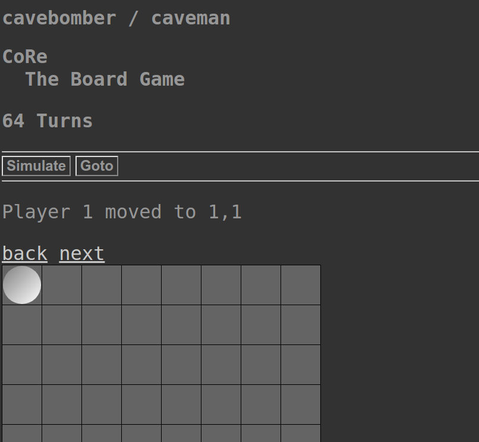

# CoRe - AI vs AI



## Game Rules

Each player turn consists of placing a stone on the board
and flipping (turning into own ones) the opponent's markers cached.

A stoned is cached if it is surrounded by enemy stones either vertically or horizontally.

When no more moves are possible, the game ends and the player with more stones on board wins.

The board is an unchecked 8-by-8 chess board.

### Corner Kills

If the enemy placed a stone at the corner of the board,
it can be flipped by placing a stone diagonally adjacent to it.

This is possible at any time for every corner.

### Example Scenario

```
.....X
..OO.X
.....X
```

If player X would place the center of the left side, both of player O's stones would be cached,
since they are surrounded horizontally (no need to be directly adjacent).

## Download

### Download via Git

```
% git clone https://github.com/ac1235/core
```

### Download via SGW

```
% sgw download ac1235 core
```

## Usage

```
# UNIX Based
% ./core ai_1 ai_2

# Windows
% python -3 src/CoRe.py ai_1 ai_2

% python src/statistic.py ai_1 ai_2 amount_of_games_to_calculate -log
    # -log is optional
```

### Example Match

```
% ./core ai_templates/caveman.py ai_templates/crazy.py
```

### Example Statistic

```
# 100 Matches
% python src/statistic.py ai_templates/caveman.py ai_templates/crazy.py 100 -log

# On *nix
% ./core -stat ai_templates/caveman.py ai_templates/crazy.py 100 -log
```
